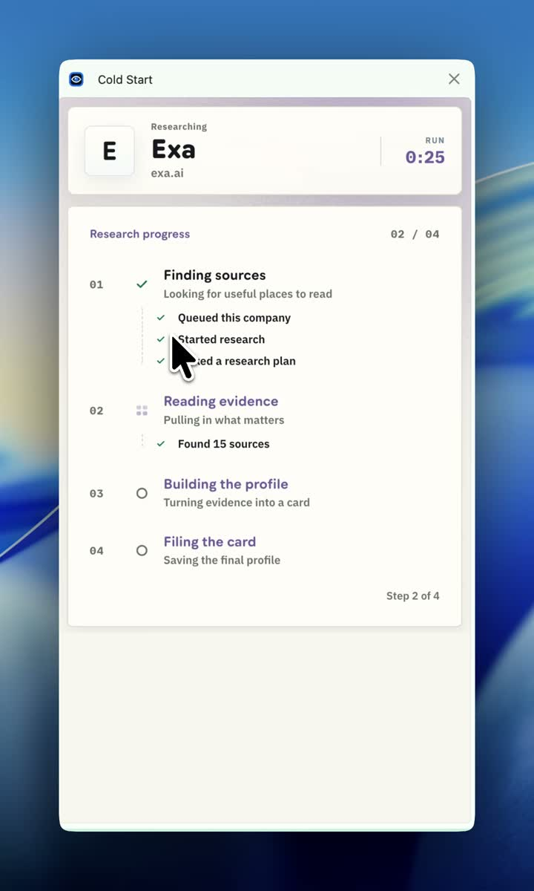
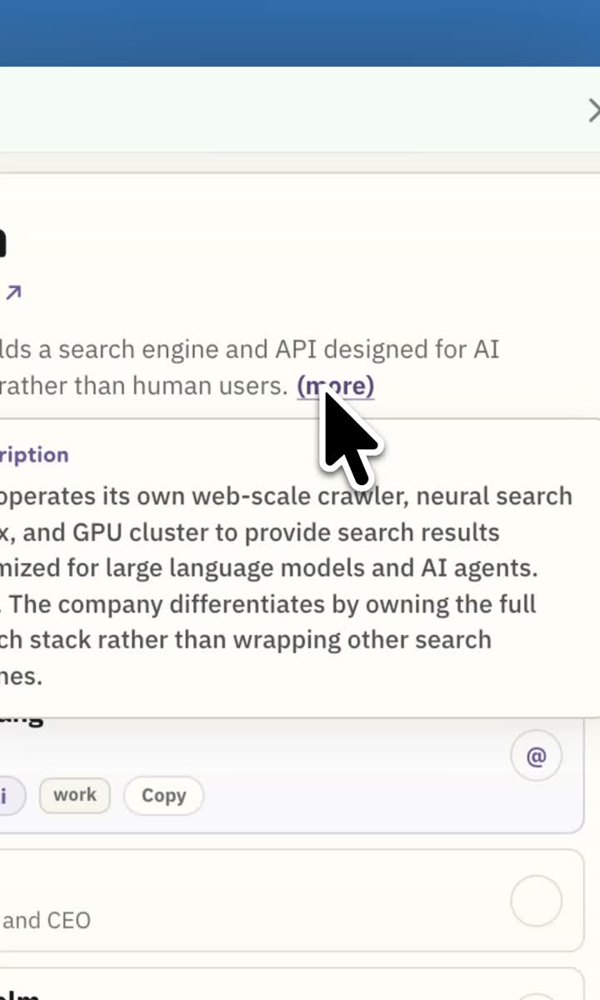
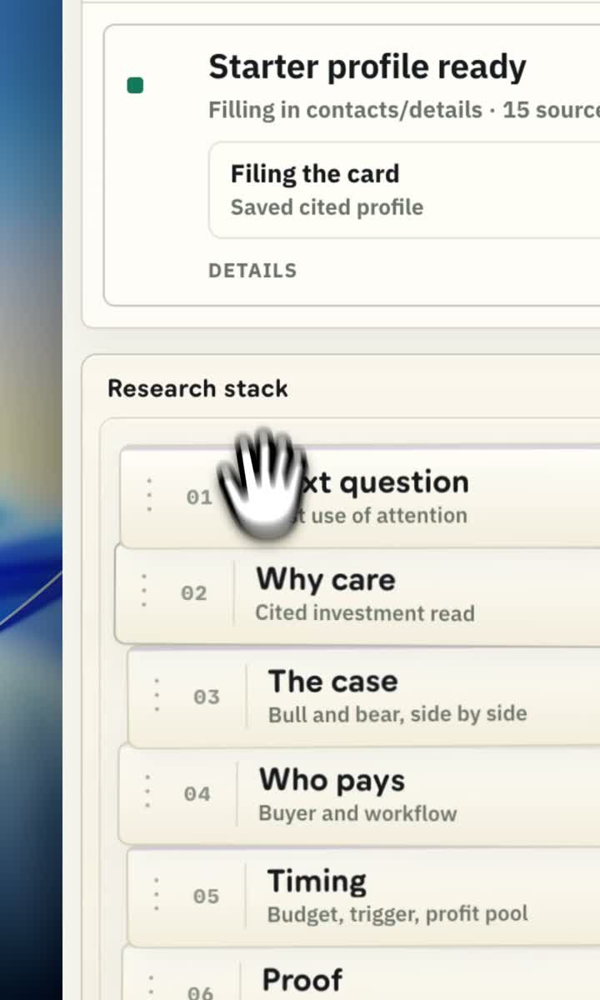
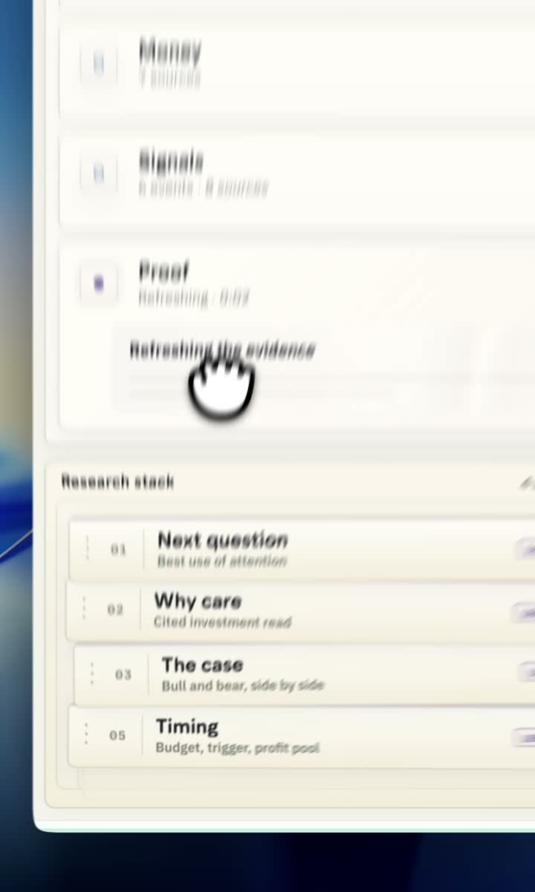
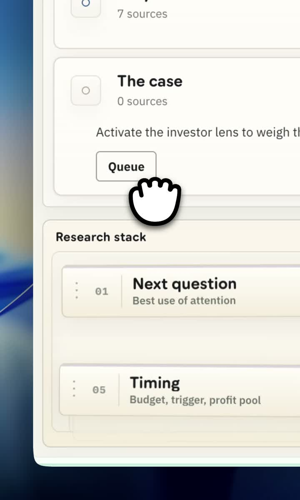
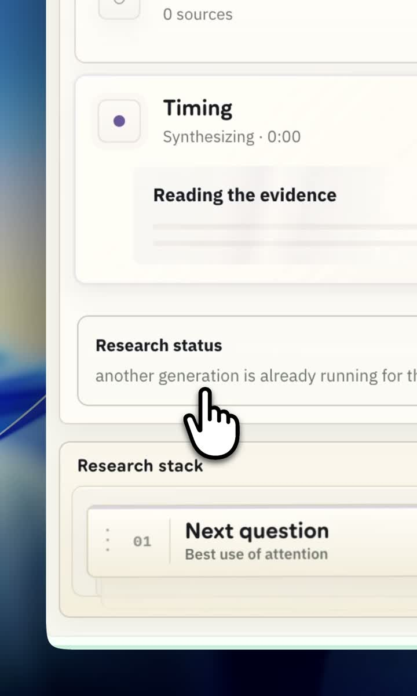
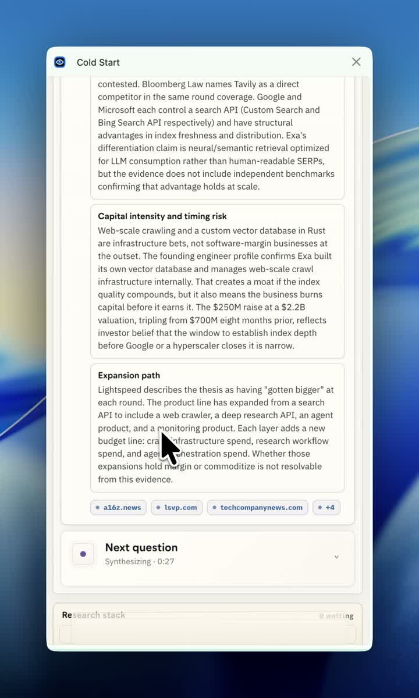

# Exa Sidebar Demo Vocabulary

Video: `/Users/samaydhawan/Downloads/coldstart-sidebar-demo.mp4`
Companion teardown: [exa-sidebar-demo-teardown.md](./exa-sidebar-demo-teardown.md)

Use these names while reviewing the demo. A good term should point to something visible on-screen or describe one precise behavior.

## Visual References

| Ref | Timestamp | Image | Use It For |
|---|---:|---|---|
| V1 | 00:30 |  | Generation progress and stage language |
| V2 | 01:05 |  | Company profile, read-more overlay, people rows |
| V3 | 01:25 |  | Starter profile panel and research stack |
| V4 | 02:20 |  | Active research card competing with stack |
| V5 | 03:25 |  | Queue button, blocked copy, stack position |
| V6 | 04:10 |  | Generated prose, section body, source-backed claims |
| V7 | 05:25 |  | Final mixed state after several card runs |

## Screen Surfaces

| Term | Meaning | Visual Cue | Seen In |
|---|---|---|---|
| `Sidebar shell` | The Chrome side panel container, including title bar and close control. | Tall narrow white panel floating over the Exa page. | V1-V7 |
| `Company profile` | The top summary for the company before research cards. | Exa logo/name, domain, one-liner, metrics, people rows. | V2, V7 |
| `Profile summary` | The short company description at the top of the profile. | One or two lines beside the company logo, with a `(more)` affordance when truncated. | V2 |
| `Read-more overlay` | Expanded profile description. | White popover opened from `(more)`. | V2 |
| `People rows` | Contact or leadership cards inside the profile. | Rows with initials, name, title, chips, and circular action control. | V2 |
| `Research header` | Small header introducing the research area. | `Research` label plus completion count such as `1 / 10`. | V3 |
| `Starter profile panel` | The status card saying the base profile is ready. | `Starter profile ready`, green dot, `Filing the card`, `DETAILS`. | V3 |
| `Active research card` | A section card currently opened, running, or showing generated content. | Expanded card with title, source count or running state, and body. | V4, V6 |
| `Research stack` | The ordered queue/list of section cards beneath the active area. | `Research stack` label and stacked cards numbered `01`, `02`, etc. | V3-V5 |
| `Research status box` | A system message about the active research run. | Box titled `Research status`. | V5 |
| `Generated section body` | The long-form answer inside a completed research card. | Dense prose blocks with subsection headings. | V6 |

## Elements

| Term | Meaning | Visual Cue | Seen In |
|---|---|---|---|
| `Status dot` | Small colored indicator for readiness or running state. | Green square/dot for starter profile, purple dot for running synthesis. | V3, V5 |
| `Evidence count` | Number of sources behind a card. | Text like `7 sources`, `0 sources`, `4 sources`. | V4-V7 |
| `Stage card` | A small progress row inside generation progress or starter profile. | `Filing the card`, `Reading evidence`, `Building the profile`. | V1, V3 |
| `Proof line` | The specific line explaining what the system is doing right now. | `Saved cited profile`, `Reading the evidence`. | V3-V5 |
| `Running proof panel` | Skeleton-like panel inside a running active card. | Pale block under `Reading the evidence`. | V4, V5 |
| `Section row` | One card in the research stack. | Numbered row with title and short description. | V3-V5 |
| `Stack index` | The number attached to a stack item. | `01`, `02`, `03`, etc. | V3-V5 |
| `Drag handle` | The dotted grip on the left of a stack item. | Vertical dot marks before the stack index. | V3-V5 |
| `Lens badge` | Small badge showing a gated or lens-backed card. | Tiny `LENS` badge on stack rows. | V3-V4 |
| `Queue button` | Button that requests a section run. | Button labeled `Queue`. | V5 |
| `Source chip` | Small pill showing a source domain. | Chips like `techcrunch.com`, `a16z.com`, `linkedin.com`. | V2, V4 |
| `Expansion caret` | Control to open or close a card. | Small caret at right edge of card row. | V4-V7 |

## States

| Term | Means | Should Feel Like | Failure Mode |
|---|---|---|---|
| `Generating profile` | The base card is being built. | Productive wait with visible progress. | Feels like repeated generic status. |
| `Starter ready` | The public/base profile has enough cited facts to show. | First payoff. The user should feel they got something. | Feels like a quiet system checkpoint. |
| `Card idle` | A research card exists but is not active. | Available and calm. | Looks disabled or unimportant. |
| `Card activatable` | A card can be queued or opened for deeper work. | Obvious next action. | User cannot tell whether it is clickable. |
| `Card running` | A research card is actively generating or refreshing. | Clear attention owner. | Stack and other elements compete with it. |
| `Card queued` | A card is waiting behind the current run. | Intentional order. | Reads like a blocked/error state. |
| `Card generated` | A card has completed and shows content. | Readable payoff with source confidence. | Becomes memo prose in a narrow panel. |
| `Not found` | The system looked and did not find enough evidence. | Honest absence. | Feels like product failure instead of evidence discipline. |
| `Queue conflict` | User asks for work while another run is active. | Calm queue explanation. | "Another generation is already running" sounds like a scold. |

## Actions

| Term | Actor | Definition | Example |
|---|---|---|---|
| `Open profile` | User/system | Bring the company profile into view. | Returning to Exa profile around 02:50. |
| `Expand profile text` | User | Open the read-more overlay for the profile summary. | `(more)` in V2. |
| `Open card` | User | Expand a section card to read its current content. | Opening `Who pays` or `Comps`. |
| `Activate card` | User | Request deeper research for a card. | Pressing `Queue` on `The case`. |
| `Queue card` | System | Put a requested card behind active work. | `Next question` waiting behind `Timing`. |
| `Run card` | System | Generate or refresh one active research card. | `Timing` synthesizing in V5. |
| `Reveal generated prose` | System | Replace running proof panel with completed content. | `Timing` body in V6. |
| `Return to stack` | User/system | Move from a card body back to the ordered research list. | Stack visible under active card in V4-V5. |

## Research Cards

| Card | In-Code Layer Id | Job | Confusion To Watch |
|---|---|---|---|
| `Next question` | `openQuestions` | Best diligence question after the read. | Can look like a generic prompt bucket. |
| `Why care` | `coreIdea` | The crisp cited investor read. | Can overlap with `The case`. |
| `The case` | `theCase` | Bull and bear, side by side. | Can become another "why this matters" card. |
| `Who pays` | `serves` | Buyer, workflow, and use case. | Must describe buyer/workflow, not product concept. |
| `Timing` | `marketStructureTiming` | Budget, adoption trigger, profit pool, timing risk. | Label may undersell market-structure content. |
| `Proof` | `customers` | Named customers, pilots, deployments, adoption evidence. | Should stay empty if proof is vague. |
| `Signals` | `signals` | Recent momentum and dated events. | Can become a news list without "so what." |
| `Money` | `investors` | Rounds, backers, amount, price context. | Needs exact source discipline. |
| `Comps` | `competition` | Alternatives and axis of overlap. | Needs auditable basis, not vibes. |
| `Product` | `mechanism` | What the product does and what is differentiated. | Can repeat homepage copy. |

## Moments

| Term | Timestamp | Definition | Why It Matters |
|---|---:|---|---|
| `Cold start wait` | 00:00-00:55 | The first generation progress loop. | Sets trust and patience. |
| `First payoff` | 01:00-01:15 | The first useful company profile is visible. | User should feel the product has earned attention. |
| `Starter payoff` | 01:15-01:30 | Starter profile is marked ready and stack appears. | Transition from system work to user choice. |
| `First investor read` | 01:30-01:45 | First card content appears, especially `Who pays`. | Shows whether the product is more than a database tile. |
| `Stack competition` | 02:00-02:30 | Active card and research stack both demand attention. | Tests hierarchy. |
| `Queue handoff` | 02:20-03:45 | Cards queue behind active generation. | Tests whether async work feels controlled. |
| `Prose reveal` | 03:45-05:05 | Dense section text replaces running state. | Tests whether generated content fits the side panel. |
| `Final read state` | 05:05-05:42 | Multiple cards are generated, queued, or idle. | Tests whether the user knows what has been learned. |

## Critique Words

| Term | Use It When | Plain Meaning |
|---|---|---|
| `Attention owner` | One element should dominate the user's eye. | The thing the screen is asking you to care about right now. |
| `Payoff` | A waiting period ends. | The product gives the user something useful. |
| `Dead wait` | Progress is visible but not informative. | The screen is moving, but the user learns nothing new. |
| `Artifact-led progress` | A progress state names concrete findings. | "Found 5 recent launches" beats "Finding sources." |
| `Verb-led progress` | A progress state only names activity. | "Reading evidence," "Building profile," "Filing card." |
| `Confidence cue` | UI helps the user trust or discount a claim. | Source count, citation chip, evidence label, or absence state. |
| `Queue clarity` | The user understands what runs now and what waits. | Active item, waiting order, and next item are legible. |
| `Memo drift` | A narrow card turns into long-form prose. | The content may be good, but it no longer feels panel-native. |
| `Concept overlap` | Two cards appear to answer the same question. | Example: `Why care` and `The case` both sounding like thesis cards. |
| `Honest empty` | A card says there is not enough evidence. | Better than inventing weak proof. |

## Short Syntax For Review Notes

Use this format when annotating the video:

```text
[timestamp] [surface > element/state/action]: observation
```

Examples:

```text
02:20 active research card > card running: attention owner is unclear because the stack remains visually loud.
03:25 research status box > queue conflict: copy is honest but sounds like a blocked state.
04:10 generated section body > memo drift: Timing content is useful but too dense for first view.
```

